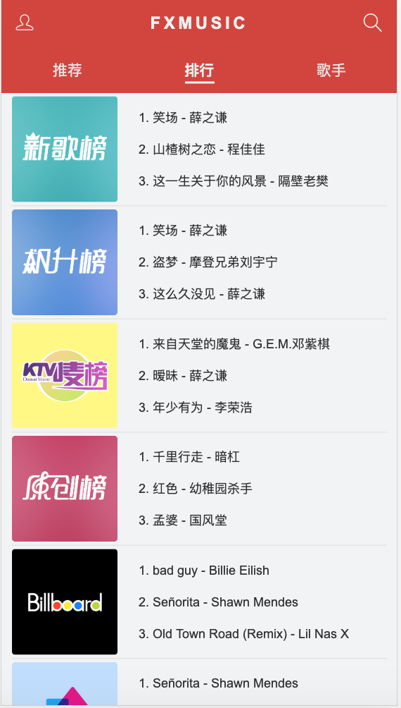
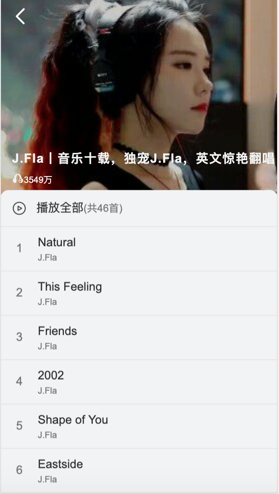
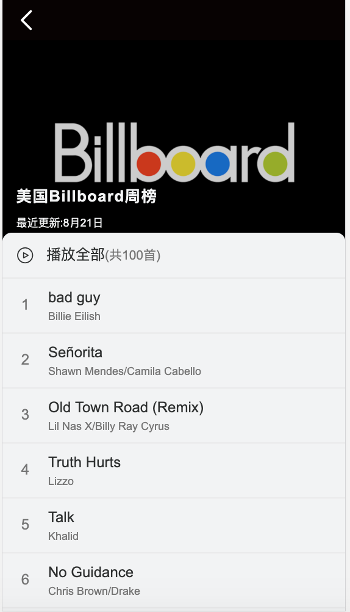
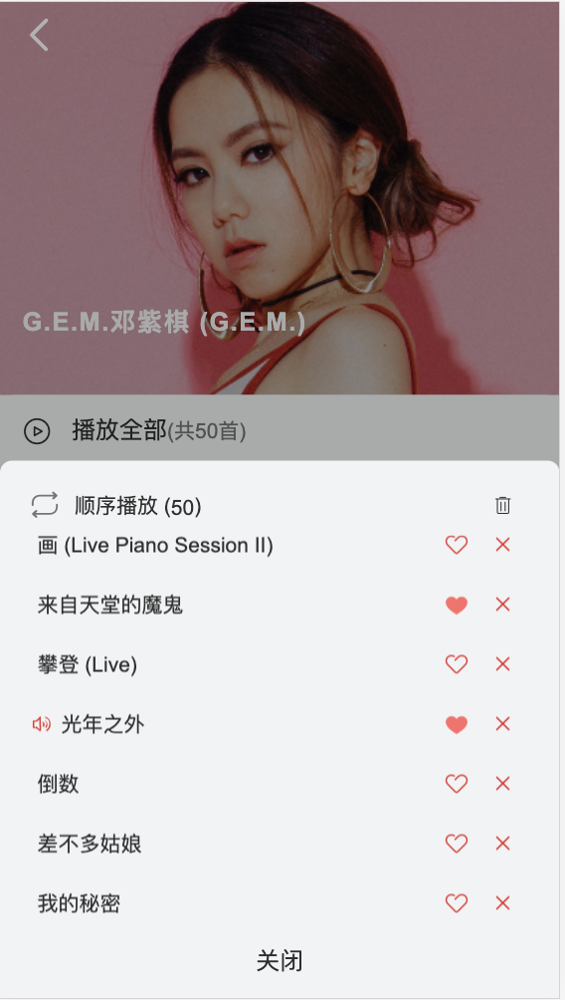
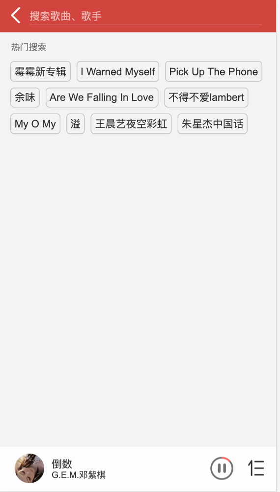

# fx-music

模仿网易云音乐开发的一款webApp，适配常见移动端
> api:一个开源的[网易云音乐 NodeJS 版 API](https://binaryify.github.io/NeteaseCloudMusicApi/#/)

## 如何安装与使用

> fx-music

``` bash
git clone https://github.com/FFFXUE/fx-music.git //下载 fx-music

cd fx-music // 进入 fx-music 播放器目录

npm install // 安装依赖

npm run dev // 运行项目

npm run build  // 项目打包
```
> 后台服务器

``` bash
下载 NeteaseCloudMusicApi

npm install // 安装依赖

node app.js // 服务端运行 访问 http://localhost:3000
```

## 技术栈

* Vue-Cli（Vue 脚手架工具）
* Vue（核心框架）
* Vue-Router（页面路由）
* Vuex（状态管理）
* vue-lazyload:实现图片懒加载，节省用户流量，优化页面加载速度
* ES 6 / 7 （JavaScript 语言的下一代标准）
* Scss（CSS预处理器）
* Axios（网络请求）
* FastClick（解决移动端 300ms 点击延迟）

## 推荐界面


## 排行榜界面


## 歌手页面


## 歌手 歌单 排行榜详情页面




## 播放器页面


## 播放列表界面



## 搜索界面



For a detailed explanation on how things work, check out the [guide](http://vuejs-templates.github.io/webpack/) and [docs for vue-loader](http://vuejs.github.io/vue-loader).
