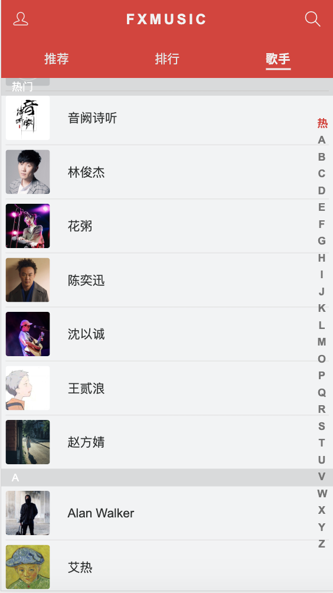
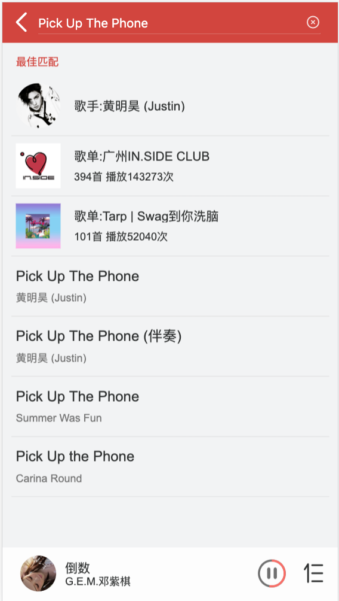
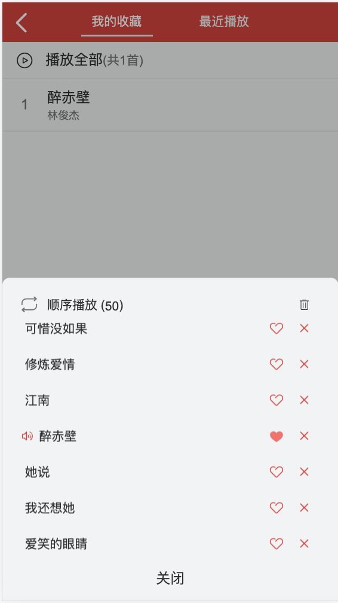
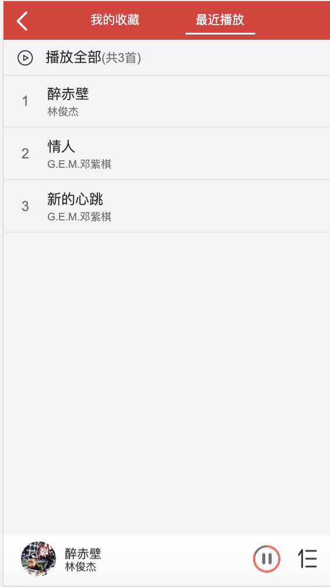

# fx-music
模仿网易云音乐开发的一款webApp，适配常见移动端
> api:一个开源的[网易云音乐 NodeJS 版 API](https://binaryify.github.io/NeteaseCloudMusicApi/#/)

## 如何安装与使用
> fx-music

``` bash
git clone https://github.com/FFFXUE/fx-music.git //下载 fx-music

cd fx-music // 进入 fx-music 播放器目录

npm install // 安装依赖

npm run dev // 运行项目

npm run build  // 项目打包
```
> 后台服务器

``` bash
下载 NeteaseCloudMusicApi

npm install // 安装依赖

node app.js // 服务端运行 访问 http://localhost:3000
```

## 技术栈
* Vue-Cli（Vue 脚手架工具）
* Vue（核心框架）
* Vue-Router（页面路由）
* Vuex（状态管理）
* vue-lazyload:实现图片懒加载，节省用户流量，优化页面加载速度
* ES 6 / 7 （JavaScript 语言的下一代标准）
* Scss（CSS预处理器）
* Axios（网络请求）
* FastClick（解决移动端 300ms 点击延迟）

## 推荐界面


## 排行榜界面


## 歌手界面


## 歌手详情界面


## 歌单详情界面


## 排行榜详情界面


## 播放器歌手界面


## 播放器歌词界面


## mini播放器界面


## mini播放器播放列表界面


## 搜索界面


## 搜索结果界面


## 收藏界面


## 播放历史界面


## 其他说明
- 个人练手项目(锻炼自己写复杂业务的能力)
- 感谢 [ustbhuangyi](https://github.com/ustbhuangyi) 老师的 [Vue2.0开发企业级移动端音乐Web App课程](https://coding.imooc.com/class/107.html)